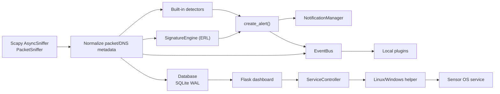
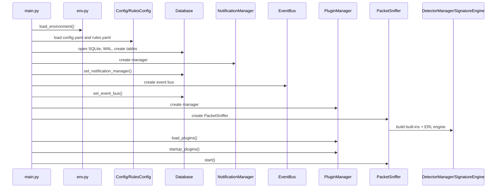
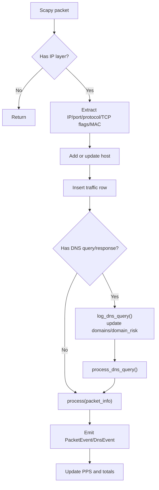
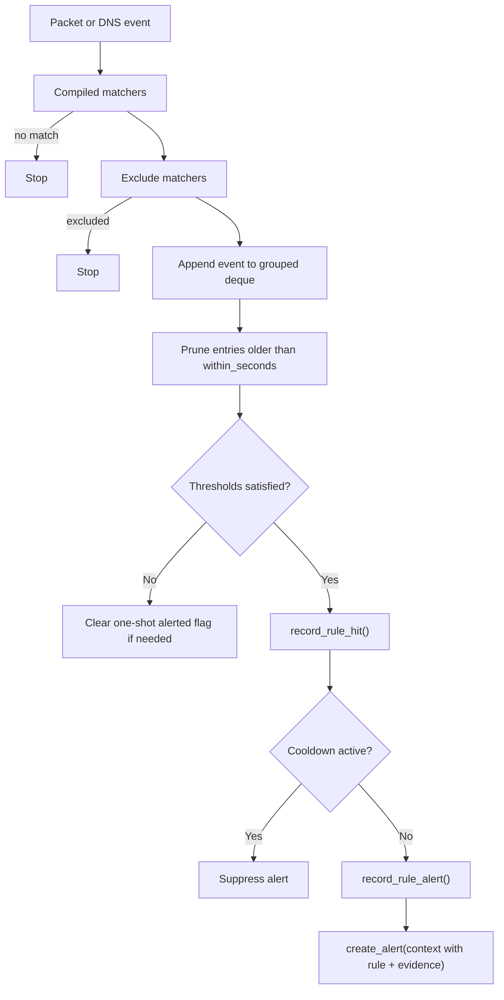
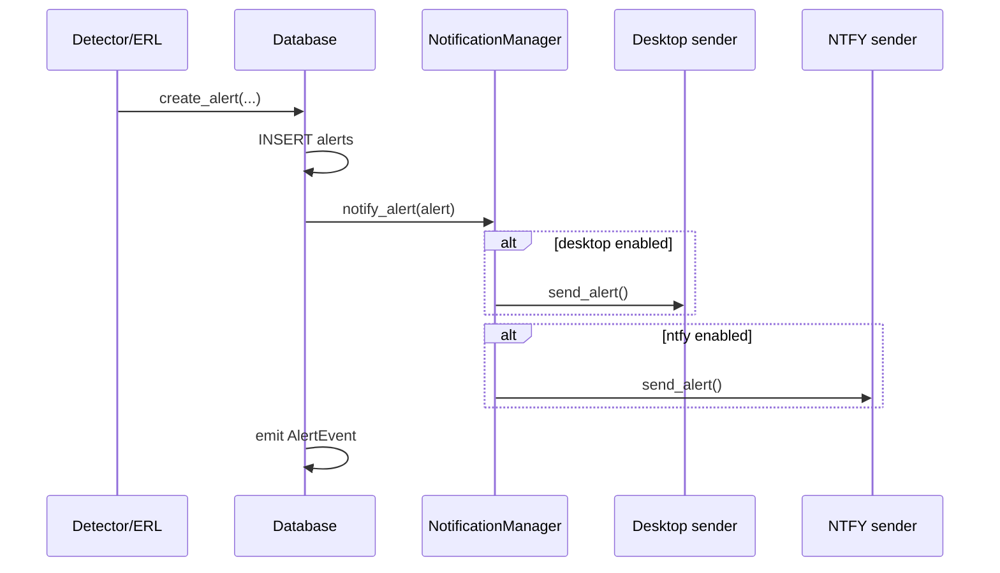
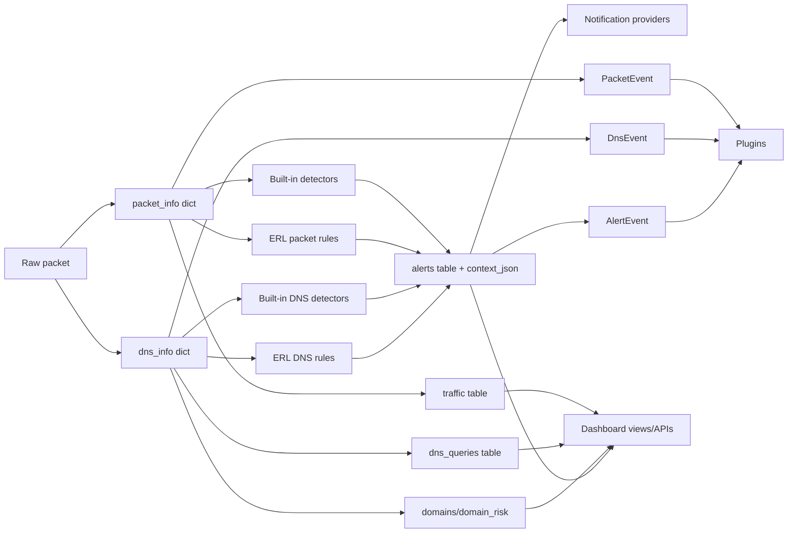
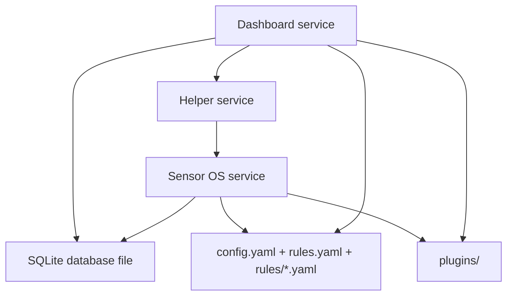
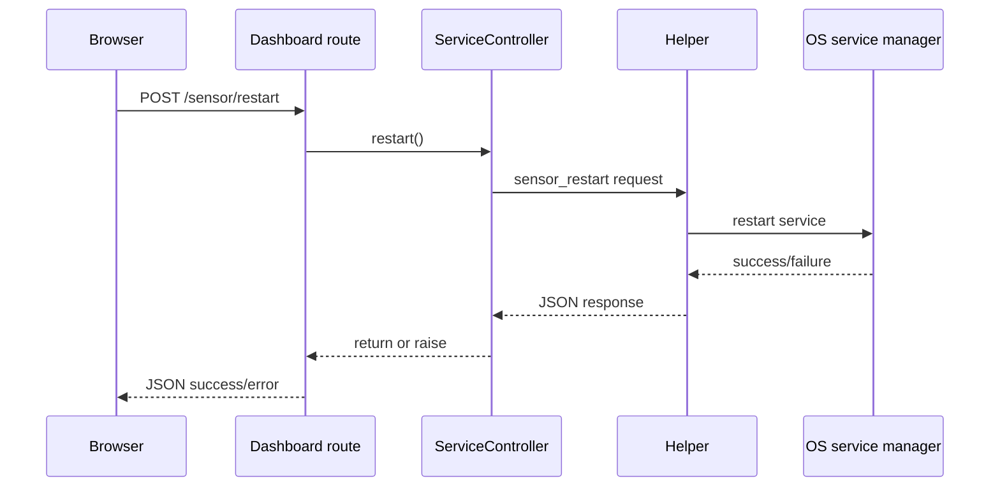
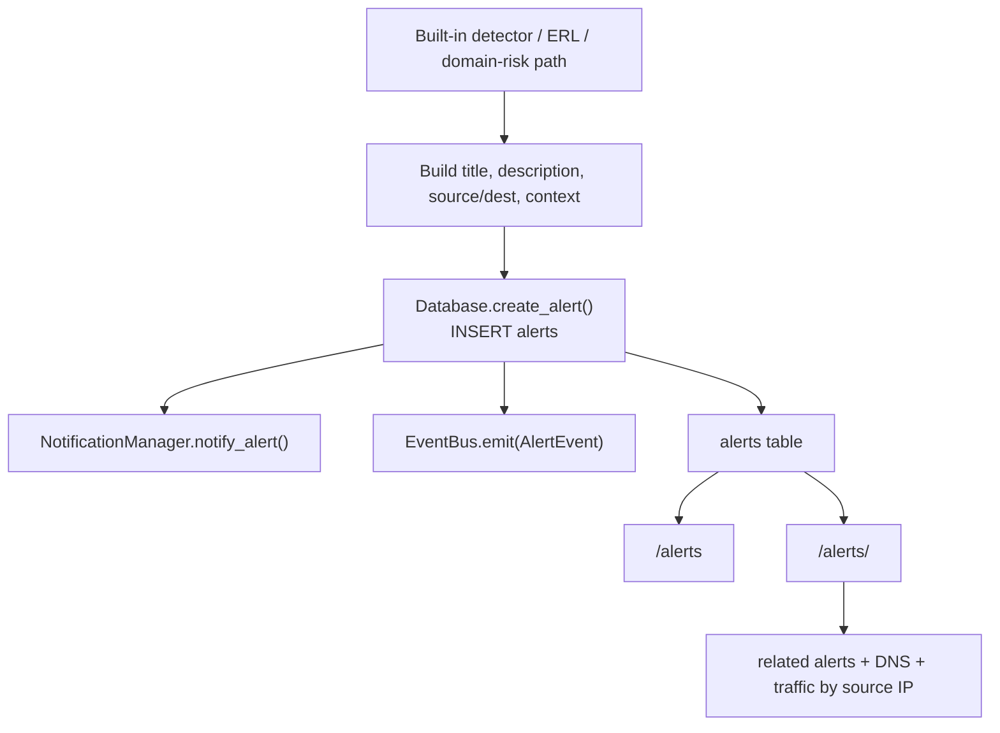

# Excalibur Codebase Guide

This document explains the current Excalibur implementation for developers who have not read the source yet. It is based on the code under `excalibur/`, the bundled plugins, the dashboard templates, and the deployment/service files in this repository.

## 1. High-level architecture

Excalibur is a local-first IDS with three main runtime surfaces:

- The sensor process in [`excalibur/main.py`](D:/Programming2/Rustic-Tools/IDS/Excalibur/excalibur/main.py) captures packets, writes telemetry to SQLite, runs detections, emits plugin events, and creates alerts.
- The dashboard in [`excalibur/dashboard/app.py`](D:/Programming2/Rustic-Tools/IDS/Excalibur/excalibur/dashboard/app.py) is a Flask app that reads from SQLite, renders views, edits configuration and rule packs, toggles plugins, and can request sensor restarts.
- The helper/service-control layer in [`excalibur/helper/`](D:/Programming2/Rustic-Tools/IDS/Excalibur/excalibur/helper) and [`excalibur/services/`](D:/Programming2/Rustic-Tools/IDS/Excalibur/excalibur/services) bridges dashboard actions to OS service control.

Core design traits:

- Local persistence uses one SQLite database in WAL mode.
- Detection is split between built-in detectors and the ERL signature engine.
- Plugin execution is synchronous, in-process, and event-driven.
- Notifications are fan-out side effects of alert creation, not a primary data path.
- The dashboard is read-heavy and treats the sensor as a separate service.

## 2. Startup sequence

### Sensor startup

The sensor boot path is centered in `ExcaliburApp.__init__()` and `ExcaliburApp.run()`:

1. `load_environment()` loads `.env` once if present.
2. Runtime paths are resolved through [`excalibur/paths.py`](D:/Programming2/Rustic-Tools/IDS/Excalibur/excalibur/paths.py).
3. `Config.load()` reads `config.yaml`, creating defaults if needed.
4. `RulesConfig.load()` reads `rules.yaml`, creating defaults if needed.
5. `Database(...)` opens SQLite, enables WAL mode, creates tables, and reconciles metrics.
6. `NotificationManager` is created and attached to the database.
7. `EventBus` is created and attached to the database.
8. `PluginManager` is created with the event bus and plugin directory.
9. `PacketSniffer` is created, which internally creates `DetectorManager`.
10. `DetectorManager` builds built-in detectors and loads/compiles ERL rule packs through `SignatureEngine`.
11. `run()` loads plugins, calls `on_startup()`, starts the sniffer, and blocks until shutdown.
12. On shutdown it stops the sniffer, shuts down plugins, and closes the database.

### Dashboard startup

The dashboard boot path is `create_app()` in [`excalibur/dashboard/app.py`](D:/Programming2/Rustic-Tools/IDS/Excalibur/excalibur/dashboard/app.py):

1. `.env` is loaded.
2. Config, rules, and rule-pack paths are resolved.
3. Flask app config is populated with database path, asset path, rule paths, and service controller.
4. Route handlers are registered inline in `create_app()`.
5. `app = create_app()` runs at module import time, so `flask --app excalibur/dashboard/app.py run` immediately constructs the full application.

### Helper startup

- Linux helper: `python -m excalibur.helper.server`
- Windows helper: `python -m excalibur.helper.windows_server`

The helper runs as a separate service and exposes only two actions: `sensor_status` and `sensor_restart`.

## 3. Packet processing workflow

The hot path is [`PacketSniffer._handle_packet()`](D:/Programming2/Rustic-Tools/IDS/Excalibur/excalibur/sensor/sniffer.py).

### Flow

1. Ignore non-IP packets.
2. Extract timestamp, IPs, MAC, ports, protocol, and TCP flags.
3. Upsert the source host in `hosts`.
4. Insert a traffic row into `traffic`.
5. If the packet contains DNS data, derive DNS query/response metadata and call `Database.log_dns_query()`.
6. If DNS metadata exists, send it to `DetectorManager.process_dns_query()`.
7. Send packet metadata to `DetectorManager.process()`.
8. Emit `PacketEvent` and optional `DnsEvent` to the event bus.
9. Update packet counters and periodic stats output.

### Important implementation details

- Protocol identification prefers `DNS`, then `TCP`, then `UDP`.
- TCP flag capture is metadata-only; payload inspection is not implemented.
- DNS responses populate `dns_rcode`; DNS queries leave it empty.
- Packet capture uses `AsyncSniffer`, so the callback path is asynchronous relative to the main thread.

## 4. Detection workflow

Detection has two parallel engines under [`DetectorManager`](D:/Programming2/Rustic-Tools/IDS/Excalibur/excalibur/detection/manager.py):

- Built-in detector classes driven by `rules.yaml`
- ERL `SignatureEngine` driven by `rules/*.yaml`

### Built-in detector workflow

`DetectorManager._build_detectors()` reads `rules.yaml` and instantiates enabled rule types:

- `portscan`
- `dns_flood`
- `unique_domains`
- `host_sweep`

Each detector maintains in-memory windows keyed by source, source/destination pair, or source/port combination. When thresholds are met, it calls `Database.create_alert()` with structured context.

### Built-in detectors

- `PortScanDetector`: SYN-only TCP scan heuristic against many destination ports on a single destination host.
- `HostSweepDetector`: many destination hosts on the same destination port.
- `DNSFloodDetector`: high DNS request rate from one client.
- `UniqueDomainDetector`: many unique domains from one client.

### Exclusions

Exclusions happen in two layers:

- `rules.yaml` global exclusions (`excluded_sources`, `exclude_own_ips`) affect built-in detectors.
- ERL `exclude:` blocks affect per-rule signature evaluation.

### Own-IP suppression

`discover_own_ips()` learns local addresses at startup and prevents Excalibur from alerting on its own traffic when `global.exclude_own_ips` is enabled.

## 5. ERL workflow

ERL is implemented entirely in [`excalibur/detection/signature_engine.py`](D:/Programming2/Rustic-Tools/IDS/Excalibur/excalibur/detection/signature_engine.py).

### Rule loading

1. `SignatureEngine.load()` ensures default rule-pack files exist.
2. It refuses to continue if legacy `signatures.yaml` still contains rules.
3. Every `rules/*.yaml` file is parsed with a custom line-based YAML parser.
4. Each parsed rule is validated.
5. Enabled rules are compiled into `CompiledSignature` objects.

### Rule model

Each rule defines:

- `event`: `packet` or `dns`
- `match`
- optional `exclude`
- `aggregate`
- `alert`
- optional `tags`
- optional `group_by`
- optional `cooldown_seconds`

### Runtime evaluation

For each event:

1. Matchers must all succeed.
2. Exclude matchers must all fail.
3. The event is added to an in-memory deque for the grouping key.
4. Old entries are pruned using `within_seconds`.
5. Aggregate counts are computed.
6. `record_rule_hit()` is called only when aggregate thresholds are satisfied.
7. Cooldown or one-shot suppression is checked.
8. `record_rule_alert()` is written.
9. `create_alert()` is called with ERL rule/evidence context.

### ERL features actually implemented

- Equality, membership, CIDR matching, substring operators, suffix operators, regex, and numeric comparisons
- `any`, `all`, `not` logic in `match`
- Aggregate types: `count`, `unique_dst_ips`, `unique_dst_ports`, `unique_domains`
- `group_by` on `src_ip` or `dst_ip`
- Cooldown suppression
- Rule-pack source inventory logging
- Optional ERL debug logging through environment variables

### ERL limitations

- Parsing is not full YAML; it uses a custom parser with a constrained structure.
- Aggregation thresholds only support `gte`.
- Grouping options are intentionally narrow.
- Rule edits in the dashboard affect files immediately, but the sensor must restart to reload them.

## 6. Database workflow

The database layer lives almost entirely in [`excalibur/database/db.py`](D:/Programming2/Rustic-Tools/IDS/Excalibur/excalibur/database/db.py).

### Responsibilities

- Open one SQLite connection with `check_same_thread=False`
- Enable WAL mode and busy timeout
- Create and migrate tables opportunistically
- Serialize alert context JSON
- Store packet, DNS, host, alert, rule-stat, and system-metric data
- Track dashboard read/write telemetry
- Enforce traffic retention
- Trigger notifications and alert events after alert writes

### Tables

- `hosts`
- `traffic`
- `alerts`
- `portscan_debug`
- `dns_queries`
- `domains`
- `domain_risk`
- `system_metrics`
- `rule_stats`

### Write flow summary

- Packet path writes `hosts`, `traffic`, and possibly `dns_queries`, `domains`, and `domain_risk`.
- Detection path writes `alerts` and `rule_stats`.
- Dashboard reads also update `system_metrics` with best-effort telemetry.

### Read flow summary

The dashboard creates a fresh `Database` object per Flask request via `g.database`. Each request executes direct SQL reads and updates read metrics unless the DB is temporarily locked, in which case read-metric updates are skipped.

### Domain-risk side path

`log_dns_query()` calls `upsert_domain()`, which:

1. Normalizes the domain.
2. Calculates risk through `DomainRiskAnalyzer`.
3. Updates `domains`.
4. Updates `domain_risk`.
5. Appends newly seen domains to `data/domains.log`.
6. Creates a browser-risk alert if score exceeds the configured threshold.

## 7. Event bus workflow

The event bus is [`EventBus`](D:/Programming2/Rustic-Tools/IDS/Excalibur/excalibur/plugins/event_bus.py).

Properties:

- Synchronous
- In-process
- No persistence
- No queueing
- Supports exact event type and wildcard `*` subscriptions
- Subscriber exceptions are logged and isolated

Event producers:

- `PacketSniffer` emits `PacketEvent` and `DnsEvent`
- `Database.create_alert()` emits `AlertEvent`
- Plugins may emit additional events through `PluginContext.emit_event()`

Event consumers:

- All loaded plugins subscribe through a wildcard handler

`HostEvent` exists but is not currently emitted anywhere in core execution.

## 8. Notification workflow

Notifications are handled by [`NotificationManager`](D:/Programming2/Rustic-Tools/IDS/Excalibur/excalibur/notifications/manager.py).

### Flow

1. A detector or ERL rule calls `Database.create_alert()`.
2. The alert row is inserted into SQLite.
3. `_notify_alert()` runs after the insert.
4. `NotificationManager.notify_alert()` checks global `notifications.enabled`.
5. If enabled, it tries each enabled provider:
   - `DesktopNotificationSender`
   - `NtfyNotificationSender`
6. Provider failures are logged but never roll back the alert write.

### Test notification flow

Dashboard `POST /api/notifications/test` calls `NotificationManager.send_test_notification()`, which uses the same provider configuration but emits synthetic messages.

## 9. Plugin workflow

Plugins are implemented in [`excalibur/plugins/`](D:/Programming2/Rustic-Tools/IDS/Excalibur/excalibur/plugins) and discovered from the runtime `plugins/` directory.

### Lifecycle

1. `PluginManager.load_plugins()` scans plugin subdirectories.
2. It reads `plugin.yaml` metadata using a simple line parser.
3. Disabled plugins are skipped.
4. Entrypoints are resolved and constrained to remain inside the plugin directory.
5. The plugin module is imported dynamically.
6. A class named `Plugin` must exist and inherit from the base `Plugin`.
7. `on_load()` runs.
8. The manager registers a wildcard event handler that calls `plugin.handle_event(event, context)`.
9. Later `startup_plugins()` runs `on_startup()`.
10. Shutdown runs `on_shutdown()`.

### Practical plugin model

- Plugins are trusted Python code running in the sensor process.
- All events are delivered to all loaded plugins.
- Filtering is the plugin’s responsibility.
- Plugins can log and emit new events, but there is no plugin-specific database API.

### Bundled plugin examples

- `hello_world`: logs every event type.
- `alert_logger`: logs alert IDs from `AlertEvent`.
- `abuseipdb`: enriches public IPs from alerts using AbuseIPDB.
- `otx_threat_intel`: loads and refreshes AlienVault OTX IOC cache and matches packet/DNS/alert events against it.

## 10. Dashboard workflow

The dashboard is a single Flask application with inline route definitions.

### Pages

- `/`: overview dashboard
- `/traffic`
- `/hosts`
- `/alerts`
- `/alerts/<id>`
- `/dns`
- `/domains`
- `/browser` and `/domain-risk`
- `/system`
- `/settings`
- `/rules`
- `/rules/<pack>/<index>`
- `/plugins`
- `/debug/portscan`

### API endpoints

- `/api/dashboard/metrics`
- `/api/dashboard/alert-trend`
- `/api/dashboard/top-rules`
- `/api/dashboard/top-sources`
- `/api/alerts/<id>/details`
- `/api/notifications/test`
- `/sensor/status`
- `/sensor/restart`

### Dashboard design choices

- Each request gets a new `Database` handle via Flask `g`.
- The dashboard does not talk directly to sensor internals.
- Any action that changes runtime sensor behavior by file edit still needs a sensor restart.
- Legacy `/signatures` routes now redirect to `/rules`.

## 11. File-by-file responsibility breakdown

This section focuses on authored files that define behavior. Vendored Monaco and Bootstrap assets are noted separately rather than listed one file at a time.

### Root and runtime config

- [`README.md`](D:/Programming2/Rustic-Tools/IDS/Excalibur/README.md): user-facing product overview and operational notes.
- [`config.example.yaml`](D:/Programming2/Rustic-Tools/IDS/Excalibur/config.example.yaml): example runtime config.
- [`config.yaml`](D:/Programming2/Rustic-Tools/IDS/Excalibur/config.yaml): local runtime config for this checkout.
- [`rules.yaml`](D:/Programming2/Rustic-Tools/IDS/Excalibur/rules.yaml): built-in detector config.
- [`rules/*.yaml`](D:/Programming2/Rustic-Tools/IDS/Excalibur/rules): ERL rule packs grouped by theme.
- [`requirements.txt`](D:/Programming2/Rustic-Tools/IDS/Excalibur/requirements.txt): Python dependencies.
- [`excalibur_launch_cmds.txt`](D:/Programming2/Rustic-Tools/IDS/Excalibur/excalibur_launch_cmds.txt): manual launch commands.

### Core package

- [`excalibur/__init__.py`](D:/Programming2/Rustic-Tools/IDS/Excalibur/excalibur/__init__.py): package marker.
- [`excalibur/main.py`](D:/Programming2/Rustic-Tools/IDS/Excalibur/excalibur/main.py): sensor application composition and lifecycle.
- [`excalibur/env.py`](D:/Programming2/Rustic-Tools/IDS/Excalibur/excalibur/env.py): one-time `.env` loading.
- [`excalibur/paths.py`](D:/Programming2/Rustic-Tools/IDS/Excalibur/excalibur/paths.py): service-layout path resolution and env overrides.
- [`excalibur/config.py`](D:/Programming2/Rustic-Tools/IDS/Excalibur/excalibur/config.py): simple config loader/saver/defaults for `config.yaml`.
- [`excalibur/service_lookup.py`](D:/Programming2/Rustic-Tools/IDS/Excalibur/excalibur/service_lookup.py): destination-port to service-name mapping and SQL `CASE` helper.

### Sensor

- [`excalibur/sensor/__init__.py`](D:/Programming2/Rustic-Tools/IDS/Excalibur/excalibur/sensor/__init__.py): re-exports `PacketSniffer`.
- [`excalibur/sensor/sniffer.py`](D:/Programming2/Rustic-Tools/IDS/Excalibur/excalibur/sensor/sniffer.py): packet capture, metadata extraction, DB writes, detector dispatch, plugin event emission, PPS stats.
- [`excalibur/sensor/packet_sensor.py`](D:/Programming2/Rustic-Tools/IDS/Excalibur/excalibur/sensor/packet_sensor.py): placeholder class, currently unused.
- [`excalibur/sensor/interface.py`](D:/Programming2/Rustic-Tools/IDS/Excalibur/excalibur/sensor/interface.py): placeholder interface, currently unused.

### Detection

- [`excalibur/detection/__init__.py`](D:/Programming2/Rustic-Tools/IDS/Excalibur/excalibur/detection/__init__.py): re-exports detector classes and ERL engine.
- [`excalibur/detection/manager.py`](D:/Programming2/Rustic-Tools/IDS/Excalibur/excalibur/detection/manager.py): orchestrates built-ins and ERL.
- [`excalibur/detection/base.py`](D:/Programming2/Rustic-Tools/IDS/Excalibur/excalibur/detection/base.py): shared sliding-window/cooldown helpers for detectors.
- [`excalibur/detection/portscan.py`](D:/Programming2/Rustic-Tools/IDS/Excalibur/excalibur/detection/portscan.py): TCP SYN port-scan detector with debug-state persistence.
- [`excalibur/detection/host_sweep.py`](D:/Programming2/Rustic-Tools/IDS/Excalibur/excalibur/detection/host_sweep.py): many-hosts-same-port detector.
- [`excalibur/detection/dns_flood.py`](D:/Programming2/Rustic-Tools/IDS/Excalibur/excalibur/detection/dns_flood.py): DNS volume detector.
- [`excalibur/detection/unique_domains.py`](D:/Programming2/Rustic-Tools/IDS/Excalibur/excalibur/detection/unique_domains.py): unique-domain burst detector.
- [`excalibur/detection/domain_risk.py`](D:/Programming2/Rustic-Tools/IDS/Excalibur/excalibur/detection/domain_risk.py): passive suspicious-domain scoring heuristics.
- [`excalibur/detection/rules_config.py`](D:/Programming2/Rustic-Tools/IDS/Excalibur/excalibur/detection/rules_config.py): simple parser/validator/default generator for `rules.yaml`.
- [`excalibur/detection/signature_engine.py`](D:/Programming2/Rustic-Tools/IDS/Excalibur/excalibur/detection/signature_engine.py): ERL parser, validator, compiler, matcher system, aggregation engine, alert context builder.
- [`excalibur/detection/own_ips.py`](D:/Programming2/Rustic-Tools/IDS/Excalibur/excalibur/detection/own_ips.py): discovers local IPs for alert suppression.
- [`excalibur/detection/alert.py`](D:/Programming2/Rustic-Tools/IDS/Excalibur/excalibur/detection/alert.py): placeholder class, currently unused.
- [`excalibur/detection/detector.py`](D:/Programming2/Rustic-Tools/IDS/Excalibur/excalibur/detection/detector.py): placeholder class, currently unused.
- [`excalibur/detection/rule.py`](D:/Programming2/Rustic-Tools/IDS/Excalibur/excalibur/detection/rule.py): placeholder class, currently unused.

### Database

- [`excalibur/database/__init__.py`](D:/Programming2/Rustic-Tools/IDS/Excalibur/excalibur/database/__init__.py): re-exports `Database`.
- [`excalibur/database/db.py`](D:/Programming2/Rustic-Tools/IDS/Excalibur/excalibur/database/db.py): SQLite schema, reads, writes, metrics, alert side effects, traffic retention.
- [`excalibur/database/connection.py`](D:/Programming2/Rustic-Tools/IDS/Excalibur/excalibur/database/connection.py): placeholder class, currently unused.
- [`excalibur/database/repository.py`](D:/Programming2/Rustic-Tools/IDS/Excalibur/excalibur/database/repository.py): placeholder repository, currently unused.

### Events and plugins

- [`excalibur/events/__init__.py`](D:/Programming2/Rustic-Tools/IDS/Excalibur/excalibur/events/__init__.py): re-exports event classes.
- [`excalibur/events/base.py`](D:/Programming2/Rustic-Tools/IDS/Excalibur/excalibur/events/base.py): minimal `BaseEvent`.
- [`excalibur/events/packet.py`](D:/Programming2/Rustic-Tools/IDS/Excalibur/excalibur/events/packet.py): packet event payload.
- [`excalibur/events/dns.py`](D:/Programming2/Rustic-Tools/IDS/Excalibur/excalibur/events/dns.py): DNS event payload.
- [`excalibur/events/alert.py`](D:/Programming2/Rustic-Tools/IDS/Excalibur/excalibur/events/alert.py): alert event payload.
- [`excalibur/events/host.py`](D:/Programming2/Rustic-Tools/IDS/Excalibur/excalibur/events/host.py): host event payload placeholder.
- [`excalibur/plugins/__init__.py`](D:/Programming2/Rustic-Tools/IDS/Excalibur/excalibur/plugins/__init__.py): re-exports plugin framework pieces.
- [`excalibur/plugins/base.py`](D:/Programming2/Rustic-Tools/IDS/Excalibur/excalibur/plugins/base.py): base plugin lifecycle hooks.
- [`excalibur/plugins/context.py`](D:/Programming2/Rustic-Tools/IDS/Excalibur/excalibur/plugins/context.py): logger wrapper and `emit_event()` surface.
- [`excalibur/plugins/event_bus.py`](D:/Programming2/Rustic-Tools/IDS/Excalibur/excalibur/plugins/event_bus.py): synchronous event dispatcher.
- [`excalibur/plugins/manager.py`](D:/Programming2/Rustic-Tools/IDS/Excalibur/excalibur/plugins/manager.py): plugin discovery, metadata parsing, import, lifecycle management.

### Notifications

- [`excalibur/notifications/__init__.py`](D:/Programming2/Rustic-Tools/IDS/Excalibur/excalibur/notifications/__init__.py): re-exports notification components.
- [`excalibur/notifications/manager.py`](D:/Programming2/Rustic-Tools/IDS/Excalibur/excalibur/notifications/manager.py): provider fan-out and test notifications.
- [`excalibur/notifications/desktop.py`](D:/Programming2/Rustic-Tools/IDS/Excalibur/excalibur/notifications/desktop.py): `plyer`-based desktop notifications.
- [`excalibur/notifications/ntfy.py`](D:/Programming2/Rustic-Tools/IDS/Excalibur/excalibur/notifications/ntfy.py): outbound NTFY relay posting.

### Dashboard

- [`excalibur/dashboard/__init__.py`](D:/Programming2/Rustic-Tools/IDS/Excalibur/excalibur/dashboard/__init__.py): re-exports `app` and `create_app`.
- [`excalibur/dashboard/app.py`](D:/Programming2/Rustic-Tools/IDS/Excalibur/excalibur/dashboard/app.py): entire Flask application, routes, helpers, data shaping, settings/rules/plugin actions.
- [`excalibur/dashboard/routes.py`](D:/Programming2/Rustic-Tools/IDS/Excalibur/excalibur/dashboard/routes.py): placeholder class, currently unused.
- [`excalibur/dashboard/templates/base.html`](D:/Programming2/Rustic-Tools/IDS/Excalibur/excalibur/dashboard/templates/base.html): shared dashboard shell.
- [`excalibur/dashboard/templates/index.html`](D:/Programming2/Rustic-Tools/IDS/Excalibur/excalibur/dashboard/templates/index.html): overview page.
- [`excalibur/dashboard/templates/traffic.html`](D:/Programming2/Rustic-Tools/IDS/Excalibur/excalibur/dashboard/templates/traffic.html): traffic table and filters.
- [`excalibur/dashboard/templates/hosts.html`](D:/Programming2/Rustic-Tools/IDS/Excalibur/excalibur/dashboard/templates/hosts.html): hosts table.
- [`excalibur/dashboard/templates/alerts.html`](D:/Programming2/Rustic-Tools/IDS/Excalibur/excalibur/dashboard/templates/alerts.html): alerts list and export/delete actions.
- [`excalibur/dashboard/templates/alert_detail.html`](D:/Programming2/Rustic-Tools/IDS/Excalibur/excalibur/dashboard/templates/alert_detail.html): alert investigation view.
- [`excalibur/dashboard/templates/dns.html`](D:/Programming2/Rustic-Tools/IDS/Excalibur/excalibur/dashboard/templates/dns.html): DNS history page.
- [`excalibur/dashboard/templates/domains.html`](D:/Programming2/Rustic-Tools/IDS/Excalibur/excalibur/dashboard/templates/domains.html): domains page and log download entry.
- [`excalibur/dashboard/templates/browser.html`](D:/Programming2/Rustic-Tools/IDS/Excalibur/excalibur/dashboard/templates/browser.html): browser/domain-risk view.
- [`excalibur/dashboard/templates/system.html`](D:/Programming2/Rustic-Tools/IDS/Excalibur/excalibur/dashboard/templates/system.html): system/storage/metrics dashboard.
- [`excalibur/dashboard/templates/settings.html`](D:/Programming2/Rustic-Tools/IDS/Excalibur/excalibur/dashboard/templates/settings.html): settings page and notification test UI.
- [`excalibur/dashboard/templates/rules.html`](D:/Programming2/Rustic-Tools/IDS/Excalibur/excalibur/dashboard/templates/rules.html): rule-pack editor and rule catalog.
- [`excalibur/dashboard/templates/rule_detail.html`](D:/Programming2/Rustic-Tools/IDS/Excalibur/excalibur/dashboard/templates/rule_detail.html): single-rule detail page.
- [`excalibur/dashboard/templates/plugins.html`](D:/Programming2/Rustic-Tools/IDS/Excalibur/excalibur/dashboard/templates/plugins.html): plugin inventory and enable/disable view.
- [`excalibur/dashboard/templates/debug_portscan.html`](D:/Programming2/Rustic-Tools/IDS/Excalibur/excalibur/dashboard/templates/debug_portscan.html): port-scan debug page.
- [`excalibur/dashboard/static/css/theme.css`](D:/Programming2/Rustic-Tools/IDS/Excalibur/excalibur/dashboard/static/css/theme.css): custom dashboard styling.
- `excalibur/dashboard/static/vendor/bootstrap/*`: bundled Bootstrap assets.
- `excalibur/dashboard/static/vendor/monaco/*`: bundled Monaco editor assets for offline rule editing.

### Helper and service control

- [`excalibur/helper/__init__.py`](D:/Programming2/Rustic-Tools/IDS/Excalibur/excalibur/helper/__init__.py): package marker.
- [`excalibur/helper/protocol.py`](D:/Programming2/Rustic-Tools/IDS/Excalibur/excalibur/helper/protocol.py): strict JSON protocol for helper actions.
- [`excalibur/helper/service_ops.py`](D:/Programming2/Rustic-Tools/IDS/Excalibur/excalibur/helper/service_ops.py): Linux `systemctl` operations for the sensor service.
- [`excalibur/helper/server.py`](D:/Programming2/Rustic-Tools/IDS/Excalibur/excalibur/helper/server.py): privileged Unix-socket helper with peer credential checks.
- [`excalibur/helper/windows_server.py`](D:/Programming2/Rustic-Tools/IDS/Excalibur/excalibur/helper/windows_server.py): Windows TCP helper for service status/restart.
- [`excalibur/services/__init__.py`](D:/Programming2/Rustic-Tools/IDS/Excalibur/excalibur/services/__init__.py): re-exports controller classes.
- [`excalibur/services/service_controller.py`](D:/Programming2/Rustic-Tools/IDS/Excalibur/excalibur/services/service_controller.py): dashboard-facing abstraction over Linux helper or Windows service manager.
- [`excalibur/services/windows_service_manager.py`](D:/Programming2/Rustic-Tools/IDS/Excalibur/excalibur/services/windows_service_manager.py): PowerShell wrapper for Windows service actions.

### Bundled plugins

- [`plugins/hello_world/plugin.yaml`](D:/Programming2/Rustic-Tools/IDS/Excalibur/plugins/hello_world/plugin.yaml): hello-world metadata.
- [`plugins/hello_world/plugin.py`](D:/Programming2/Rustic-Tools/IDS/Excalibur/plugins/hello_world/plugin.py): wildcard event logger.
- [`plugins/alert_logger/plugin.yaml`](D:/Programming2/Rustic-Tools/IDS/Excalibur/plugins/alert_logger/plugin.yaml): alert logger metadata.
- [`plugins/alert_logger/plugin.py`](D:/Programming2/Rustic-Tools/IDS/Excalibur/plugins/alert_logger/plugin.py): logs alert events.
- [`plugins/abuseipdb/plugin.yaml`](D:/Programming2/Rustic-Tools/IDS/Excalibur/plugins/abuseipdb/plugin.yaml): AbuseIPDB plugin metadata.
- [`plugins/abuseipdb/plugin.py`](D:/Programming2/Rustic-Tools/IDS/Excalibur/plugins/abuseipdb/plugin.py): public-IP enrichment on alerts.
- [`plugins/otx_threat_intel/plugin.yaml`](D:/Programming2/Rustic-Tools/IDS/Excalibur/plugins/otx_threat_intel/plugin.yaml): OTX plugin metadata.
- [`plugins/otx_threat_intel/plugin.py`](D:/Programming2/Rustic-Tools/IDS/Excalibur/plugins/otx_threat_intel/plugin.py): OTX cache refresh and IOC matching.
- [`plugins/otx_threat_intel/README.md`](D:/Programming2/Rustic-Tools/IDS/Excalibur/plugins/otx_threat_intel/README.md): OTX plugin usage documentation.

### Deployment and operations

- [`systemd/excalibur-helper.service`](D:/Programming2/Rustic-Tools/IDS/Excalibur/systemd/excalibur-helper.service): Linux helper service unit.
- [`scripts/windows/services/ExcaliburSensor.xml`](D:/Programming2/Rustic-Tools/IDS/Excalibur/scripts/windows/services/ExcaliburSensor.xml): WinSW service definition for sensor.
- [`scripts/windows/services/ExcaliburDashboard.xml`](D:/Programming2/Rustic-Tools/IDS/Excalibur/scripts/windows/services/ExcaliburDashboard.xml): WinSW service definition for dashboard.
- [`scripts/windows/services/ExcaliburHelper.xml`](D:/Programming2/Rustic-Tools/IDS/Excalibur/scripts/windows/services/ExcaliburHelper.xml): WinSW service definition for Windows helper.
- [`scripts/windows/install.ps1`](D:/Programming2/Rustic-Tools/IDS/Excalibur/scripts/windows/install.ps1): Windows installation automation.
- [`scripts/windows/uninstall.ps1`](D:/Programming2/Rustic-Tools/IDS/Excalibur/scripts/windows/uninstall.ps1): Windows uninstall automation.

### Documentation

- [`docs/architecture.md`](D:/Programming2/Rustic-Tools/IDS/Excalibur/docs/architecture.md): project architecture intent.
- [`docs/ArchitectureIntent.txt`](D:/Programming2/Rustic-Tools/IDS/Excalibur/docs/ArchitectureIntent.txt): product direction and non-goals.
- [`docs/ERL_documentation.md`](D:/Programming2/Rustic-Tools/IDS/Excalibur/docs/ERL_documentation.md): ERL specification.
- [`docs/signatures.md`](D:/Programming2/Rustic-Tools/IDS/Excalibur/docs/signatures.md): rule-pack/signature documentation.
- [`docs/plugins.md`](D:/Programming2/Rustic-Tools/IDS/Excalibur/docs/plugins.md): current plugin framework guide.
- [`docs/browser_threats.md`](D:/Programming2/Rustic-Tools/IDS/Excalibur/docs/browser_threats.md): browser threat protection details.
- [`docs/storage_review.md`](D:/Programming2/Rustic-Tools/IDS/Excalibur/docs/storage_review.md): storage considerations.
- [`docs/windows-install.md`](D:/Programming2/Rustic-Tools/IDS/Excalibur/docs/windows-install.md): Windows deployment instructions.
- [`docs/phase4_plugin_architecture.md`](D:/Programming2/Rustic-Tools/IDS/Excalibur/docs/phase4_plugin_architecture.md): future-looking plugin architecture notes.
- [`docs/ExcaliburVision.md`](D:/Programming2/Rustic-Tools/IDS/Excalibur/docs/ExcaliburVision.md): broader vision doc.
- [`docs/changelog/2026-06-15-phase2-expansion.md`](D:/Programming2/Rustic-Tools/IDS/Excalibur/docs/changelog/2026-06-15-phase2-expansion.md): milestone changelog.

### Tests

- [`tests/test_config.py`](D:/Programming2/Rustic-Tools/IDS/Excalibur/tests/test_config.py): config parsing/default behavior.
- [`tests/test_env_loading.py`](D:/Programming2/Rustic-Tools/IDS/Excalibur/tests/test_env_loading.py): `.env` loading semantics.
- [`tests/test_platform_paths.py`](D:/Programming2/Rustic-Tools/IDS/Excalibur/tests/test_platform_paths.py): runtime path resolution.
- [`tests/test_portscan.py`](D:/Programming2/Rustic-Tools/IDS/Excalibur/tests/test_portscan.py): built-in port scan detection.
- [`tests/test_detection_rules.py`](D:/Programming2/Rustic-Tools/IDS/Excalibur/tests/test_detection_rules.py): detector/rules behavior.
- [`tests/test_detector_manager.py`](D:/Programming2/Rustic-Tools/IDS/Excalibur/tests/test_detector_manager.py): detector orchestration.
- [`tests/test_signature_engine.py`](D:/Programming2/Rustic-Tools/IDS/Excalibur/tests/test_signature_engine.py): ERL parsing and runtime behavior.
- [`tests/test_browser_threats.py`](D:/Programming2/Rustic-Tools/IDS/Excalibur/tests/test_browser_threats.py): domain-risk scoring and browser alerts.
- [`tests/test_dns_collection.py`](D:/Programming2/Rustic-Tools/IDS/Excalibur/tests/test_dns_collection.py): DNS extraction/logging path.
- [`tests/test_database_concurrency.py`](D:/Programming2/Rustic-Tools/IDS/Excalibur/tests/test_database_concurrency.py): SQLite concurrency expectations.
- [`tests/test_traffic_retention.py`](D:/Programming2/Rustic-Tools/IDS/Excalibur/tests/test_traffic_retention.py): traffic retention enforcement.
- [`tests/test_traffic_queries.py`](D:/Programming2/Rustic-Tools/IDS/Excalibur/tests/test_traffic_queries.py): traffic query/filter/sort behavior.
- [`tests/test_system_health.py`](D:/Programming2/Rustic-Tools/IDS/Excalibur/tests/test_system_health.py): system metrics/health payload.
- [`tests/test_alert_exports.py`](D:/Programming2/Rustic-Tools/IDS/Excalibur/tests/test_alert_exports.py): alert CSV/JSON export endpoints.
- [`tests/test_dashboard_metrics.py`](D:/Programming2/Rustic-Tools/IDS/Excalibur/tests/test_dashboard_metrics.py): dashboard summary APIs.
- [`tests/test_settings.py`](D:/Programming2/Rustic-Tools/IDS/Excalibur/tests/test_settings.py): settings page behavior.
- [`tests/test_plugins_page.py`](D:/Programming2/Rustic-Tools/IDS/Excalibur/tests/test_plugins_page.py): dashboard plugin page behavior.
- [`tests/test_sensor_controls.py`](D:/Programming2/Rustic-Tools/IDS/Excalibur/tests/test_sensor_controls.py): sensor status/restart endpoints.
- [`tests/test_plugin_framework.py`](D:/Programming2/Rustic-Tools/IDS/Excalibur/tests/test_plugin_framework.py): plugin loader and event bus behavior.
- [`tests/test_abuseipdb_plugin.py`](D:/Programming2/Rustic-Tools/IDS/Excalibur/tests/test_abuseipdb_plugin.py): AbuseIPDB plugin logic.
- [`tests/test_otx_threat_intel_plugin.py`](D:/Programming2/Rustic-Tools/IDS/Excalibur/tests/test_otx_threat_intel_plugin.py): OTX plugin cache/matching logic.
- [`tests/test_notifications.py`](D:/Programming2/Rustic-Tools/IDS/Excalibur/tests/test_notifications.py): notification manager flows.
- [`tests/test_notification_sender.py`](D:/Programming2/Rustic-Tools/IDS/Excalibur/tests/test_notification_sender.py): provider sender behavior.
- [`tests/test_service_controller.py`](D:/Programming2/Rustic-Tools/IDS/Excalibur/tests/test_service_controller.py): service controller abstraction.
- [`tests/test_windows_service_manager.py`](D:/Programming2/Rustic-Tools/IDS/Excalibur/tests/test_windows_service_manager.py): Windows service manager shell wrapper.
- [`tests/test_helper_protocol.py`](D:/Programming2/Rustic-Tools/IDS/Excalibur/tests/test_helper_protocol.py): helper protocol validation.
- [`tests/test_helper_service_ops.py`](D:/Programming2/Rustic-Tools/IDS/Excalibur/tests/test_helper_service_ops.py): Linux helper systemctl wrapper.
- [`tests/test_helper_server.py`](D:/Programming2/Rustic-Tools/IDS/Excalibur/tests/test_helper_server.py): Linux helper server and Unix-socket handling.
- [`tests/test_windows_helper_server.py`](D:/Programming2/Rustic-Tools/IDS/Excalibur/tests/test_windows_helper_server.py): Windows helper TCP server behavior.
- [`tests/test_structure.py`](D:/Programming2/Rustic-Tools/IDS/Excalibur/tests/test_structure.py): broad project structure expectations.
- [`tests/__init__.py`](D:/Programming2/Rustic-Tools/IDS/Excalibur/tests/__init__.py): test package marker.

## 12. Data flow between components

### Primary data objects

- `packet_info`: normalized packet metadata dict
- `dns_info`: normalized DNS metadata dict with optional risk fields
- SQLite rows: traffic, hosts, dns queries, domains, alerts, stats
- Event objects: `PacketEvent`, `DnsEvent`, `AlertEvent`
- Alert context JSON: serialized rule/evidence snapshot embedded with each alert

### Flow summary

### Key boundaries

- The database is the persistence and reporting boundary between sensor and dashboard.
- The event bus is the in-process extensibility boundary inside the sensor.
- The helper/service controller is the OS-control boundary between dashboard and service manager.

## 13. Service startup dependencies

### Functional dependencies

- Sensor depends on:
  - Python environment with Scapy and runtime dependencies
  - readable/writable config, rule, plugin, and data paths
  - permission to capture packets
  - SQLite file access
- Dashboard depends on:
  - Python/Flask runtime
  - access to the same config/rules/plugins paths
  - read access to the same SQLite database
  - optional helper service for restart/status actions
- Linux helper depends on:
  - root execution
  - `/bin/systemctl`
  - `excalibur` user and group for socket authorization
- Windows helper depends on:
  - PowerShell
  - Windows service names matching the configured constants

### Runtime dependency graph

### Practical startup order

Recommended order for a deployed node:

1. Helper service
2. Sensor service
3. Dashboard service

The dashboard can still render historical data without the sensor running, but restart/status controls become degraded if the helper is unavailable.

## 14. Request lifecycle for dashboard actions

Most dashboard actions follow one of three patterns.

### Read-only page/API request

1. Flask route executes.
2. `get_database()` creates a request-scoped `Database`.
3. SQL queries run.
4. Rows are reshaped into template or JSON payloads.
5. Teardown closes the database connection.

### File-edit action

Used for settings, rules, and plugin toggles.

1. Route reads request form data.
2. Input is validated with lightweight parser logic.
3. The target file is rewritten directly.
4. Browser is redirected back to the page.
5. Runtime behavior only changes after sensor restart if the file is consumed by the sensor.

### Service-control action

Used for `/sensor/status` and `/sensor/restart`.

### Common dashboard actions and what they mutate

- Save settings: rewrites `config.yaml`
- Save legacy built-in rule settings: rewrites `rules.yaml`
- Save/import/format/toggle ERL rule packs: rewrites files in `rules/*.yaml`
- Toggle plugin: rewrites `enabled:` inside `plugins/<plugin>/plugin.yaml`
- Test notification: no persistence, sends provider test message
- Delete alert(s): deletes rows from `alerts` only

## 15. Alert creation lifecycle

All alert sources converge on `Database.create_alert()`.

### Sources of alerts

- `PortScanDetector`
- `HostSweepDetector`
- `DNSFloodDetector`
- `UniqueDomainDetector`
- `SignatureEngine` compiled ERL rules
- Browser threat protection through `Database._create_domain_risk_alert_if_needed()`

### Lifecycle

1. A detection engine decides a threshold has been met.
2. It builds human-readable title/description and structured context.
3. `Database.create_alert()` inserts the alert row.
4. Notification fan-out runs.
5. `AlertEvent` is emitted to plugins.
6. The alert becomes visible in the dashboard and export endpoints.
7. The alert detail page reconstructs rule/evidence/related-activity views from `context_json` and source-IP lookups.

### What makes alert detail pages useful

Alert rows carry a frozen `context_json` snapshot at creation time. That snapshot includes:

- rule name
- rule pack
- tags
- event type
- thresholds
- window size
- observed evidence

This means investigation pages do not need to re-run the original rule logic.

## Additional observations

### Architectural strengths

- The end-to-end flow is easy to follow because composition is concentrated in a few files.
- The database is the clear contract between sensor and dashboard.
- ERL and built-in detectors coexist cleanly.
- Plugin risk is explicit: trusted code, no sandboxing, synchronous delivery.

### Architectural constraints

- Several modules are placeholders and suggest an unfinished abstraction layer.
- The dashboard is monolithic; all routes and helper functions live in one file.
- Config and rule parsing are custom and intentionally narrow.
- No hot reload exists for rules or plugins.
- Plugin execution and event delivery are synchronous, so slow plugins can slow the sensor path.

### Suggested reading order after this document

1. [`excalibur/main.py`](D:/Programming2/Rustic-Tools/IDS/Excalibur/excalibur/main.py)
2. [`excalibur/sensor/sniffer.py`](D:/Programming2/Rustic-Tools/IDS/Excalibur/excalibur/sensor/sniffer.py)
3. [`excalibur/detection/manager.py`](D:/Programming2/Rustic-Tools/IDS/Excalibur/excalibur/detection/manager.py)
4. [`excalibur/detection/signature_engine.py`](D:/Programming2/Rustic-Tools/IDS/Excalibur/excalibur/detection/signature_engine.py)
5. [`excalibur/database/db.py`](D:/Programming2/Rustic-Tools/IDS/Excalibur/excalibur/database/db.py)
6. [`excalibur/dashboard/app.py`](D:/Programming2/Rustic-Tools/IDS/Excalibur/excalibur/dashboard/app.py)
7. [`excalibur/plugins/manager.py`](D:/Programming2/Rustic-Tools/IDS/Excalibur/excalibur/plugins/manager.py)
8. [`excalibur/helper/server.py`](D:/Programming2/Rustic-Tools/IDS/Excalibur/excalibur/helper/server.py) and [`excalibur/services/service_controller.py`](D:/Programming2/Rustic-Tools/IDS/Excalibur/excalibur/services/service_controller.py)
